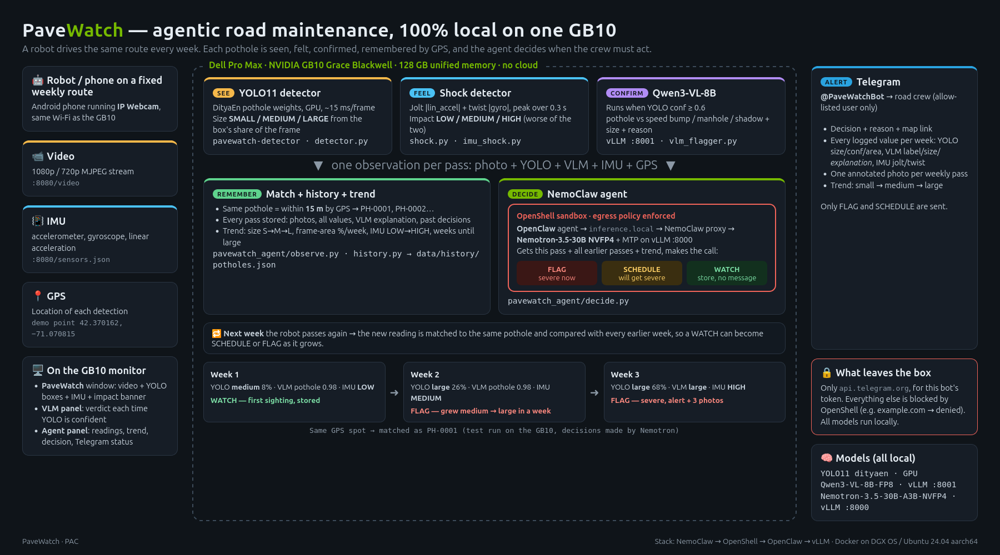

# PaveWatch: agentic pothole monitoring, 100% local on one GB10

A robot drives the same route every week. PaveWatch **sees** potholes with a camera, **feels** them with the
IMU, **confirms** them with a vision-language model, **remembers** each one by GPS, and lets an **agent**
decide when the road crew must act. Alerts go to Telegram. Every model runs on a single NVIDIA GB10 box;
the only traffic that leaves it is the Telegram message.



| Stage | What it does | Runs on | Code |
|---|---|---|---|
| **See** | YOLO11 finds potholes, grades **SMALL / MEDIUM / LARGE** | GPU | `pavewatch/detector.py` |
| **Feel** | Jolt + twist from the phone IMU, graded **LOW / MEDIUM / HIGH** | CPU | `pavewatch/shock.py`, `imu_shock.py` |
| **Confirm** | Qwen3-VL-8B: pothole vs speed bump / manhole / shadow, size + reason | vLLM `:8001` | `vlm/vlm_flagger.py` |
| **Remember** | One observation per pass (photo + all values + GPS), matched to the same pothole within 15 m, week-over-week trend | host | `pavewatch_agent/observe.py`, `history.py` |
| **Decide** | Nemotron-3.5-30B agent in an OpenShell sandbox: **FLAG / SCHEDULE / WATCH** | vLLM `:8000` via NemoClaw | `pavewatch_agent/decide.py` |
| **Alert** | Telegram report with every logged value, the VLM explanations and one photo per week | OpenClaw | `pavewatch_agent/decide.py` |

Example from one spot, three weekly passes:

| Week | Readings | Agent |
|---|---|---|
| 1 | YOLO medium (8% of frame) · VLM pothole 0.98 · IMU LOW | **WATCH**: stored, no message |
| 2 | YOLO large (26%) · VLM pothole 0.98 · IMU MEDIUM | **FLAG**: grew medium → large in a week |
| 3 | YOLO large (68%) · VLM large · IMU HIGH | **FLAG**: severe; report + 3 photos |

## Quick start

```bash
git clone https://github.com/Adityaagulatii/PAC.git
cd PAC
pip install -r requirements.txt
python live_view.py --ip <phone-ip>
```

This runs **See + Feel** live. For the full pipeline (VLM, history, agent, Telegram) see
[Full pipeline](#full-pipeline).

Press **q** in the video window to quit. The pothole model is included at `models/pothole_yolo11.pt`,
so there's nothing else to download.

> On Python 3.14, if `pip install` fails for `opencv-python` or `ultralytics`, use Python 3.12.

## Phone setup (IP Webcam)

1. Install **IP Webcam** on the phone.
2. In its settings, open **Data logging**, turn it **on**, and tick **Accelerometer**, **Gyroscope**
   and **Linear acceleration**. Without this, the video works but impacts never show.
3. Under **Video preferences**, set the resolution to **720p** and the frame rate to **15 fps**.
4. Tap **Start server** and note the IP address it shows, e.g. `http://172.20.65.194:8080`.
5. Keep the app open with the screen on. Android may pause the sensors in the background.

Put the phone and the computer on the **same Wi-Fi network**, then check both endpoints from the computer:

```bash
curl http://<phone-ip>:8080/sensors.json   # should print numbers, not {}
```

and open `http://<phone-ip>:8080/video` in a browser to see the stream.

## What you see

| On screen | Meaning |
|---|---|
| Box + `SMALL / MEDIUM / LARGE pothole 0.83` | YOLO detection, its size grade and confidence. Yellow, orange or red by size |
| `YOLO 210 ms  potholes: medium` | Time per detection pass and what is in view now |
| `lin_accel` / `gyro` rows (top left) | Live sensor values. A red **IMU: no sensor data from phone** line means Data logging is off |
| `IMPACT LOW / MEDIUM / HIGH` + coloured border | A bump was felt, shown for 3 s with its jolt and twist values |
| List at bottom left | The last 3 impacts |

The video is rotated 90° clockwise to match the phone mount. Use `--no-rotate` to turn this off.

## How grading works

**Pothole size.** Size comes from the share of the frame that the detection box covers:

| Size | Box covers |
|---|---|
| SMALL | under 3% |
| MEDIUM | 3–10% |
| LARGE | 10% or more |

This is the *apparent* size, so the same pothole looks larger as you get closer. Compare potholes
at a similar distance ahead of the mount.

**Impact level.** Two sensor signals are graded on their own, and the impact takes the worse of the two:

| Signal | Sensor | Starts an impact | MEDIUM from | HIGH from |
|---|---|---|---|---|
| Jolt | linear acceleration (m/s²) | 3.0 | 4.0 | 5.5 |
| Twist | gyroscope (rad/s) | 2.0 | 3.0 | 4.0 |

After a trigger, the peak of each signal is taken over 0.3 s. New triggers are then ignored for 1 s,
so the rebound from one bump doesn't count as a second impact.

These thresholds were set from manual bumps with the phone in hand. **Re-tune them once the phone is
on the carrier** (see [Tuning](#tuning)).

## Full pipeline

The **Confirm → Remember → Decide → Alert** stages need the local model servers and the agent sandbox
(see [Running on the GB10](#running-on-the-gb10)).

**1. Record one pass per week** (same route, same phone mount):

```bash
python live_view.py --record data/week1      # next week: data/week2, then data/week3 ...
```

**2. Run the pass through the pipeline:**

```bash
export PAVEWATCH_TELEGRAM_ID=<your Telegram user id>   # ask @userinfobot
pavewatch_agent/run_pass.sh data/week1
```

`run_pass.sh` does, in order:

1. **observe**: runs YOLO over the video and keeps the most confident detection (conf ≥ 0.6), saves that
   frame, asks the VLM about it, and takes the worst IMU impact within 2 s of it (or the worst of the pass).
2. **remember**: matches the observation to a known pothole within 15 m (`data/history/potholes.json`),
   or starts a new one (`PH-0001`, `PH-0002`, …), and computes the trend across weeks.
3. **decide**: if the VLM confirmed a pothole, the agent gets this pass, every earlier pass and the trend,
   and answers **FLAG** (severe now), **SCHEDULE** (will become severe) or **WATCH** (keep monitoring).
4. **alert**: FLAG and SCHEDULE send a Telegram report: decision and reason, map link, every logged value
   per week (YOLO size/conf/area, VLM label/size/explanation, IMU jolt/twist) and one annotated photo per
   pass. WATCH is stored silently and compared against next week's pass.

A single photo works too, with the IMU level given by hand:

```bash
pavewatch_agent/run_pass.sh images/1.jpg --impact low
```

Options: `--gps LAT LON` sets the location (default: the demo point in `pavewatch_agent/config.py`);
`WEEK=N`, `HISTORY=dir` and `NO_TELEGRAM=1` are read from the environment.

**On-screen panels** (open next to the `live_view.py` window):

```bash
pavewatch_agent/panels/vlm_panel.sh     # VLM verdict each time YOLO is confident
pavewatch_agent/panels/agent_panel.sh   # readings, trend, decision and Telegram status per pass
```

The VLM check also runs on its own over a folder of images:

```bash
python vlm/vlm_flagger.py --images images --out results   # results.csv + flagged.json
```

## Running on the GB10

Everything runs locally on a Dell Pro Max with NVIDIA GB10 (Grace Blackwell, 128 GB unified memory):

| Service | Model | How |
|---|---|---|
| Detector | YOLO11 (`models/pothole_yolo11.pt`) | ultralytics on the GPU |
| VLM | Qwen3-VL-8B-Instruct-FP8 | vLLM `:8001`, `--gpu-memory-utilization 0.22`, `VLLM_USE_DEEP_GEMM=0` (needed on GB10) |
| Agent LLM | Nemotron-3.5-Lightning-30B-A3B-NVFP4 + MTP | vLLM `:8000`, NVIDIA's GB10 recipe, `--gpu-memory-utilization 0.50` |
| Agent | OpenClaw in an OpenShell sandbox | NemoClaw, custom provider → `localhost:8000`, Telegram channel |

Both vLLM servers bind to `127.0.0.1` only. The sandbox reaches the agent LLM through NemoClaw's
inference proxy, and its egress policy allows `api.telegram.org` for the bot token only.

## Logs

Every run of `live_view.py` writes to a new folder, `logs/<date_time>/`:

**`potholes.csv`** has one row per detection pass in which a pothole was seen (about 4–5 per second
while one is in view):

```
time,pc_time,size,area_pct,conf,x1,y1,x2,y2
14:07:40,1791050860.490,medium,7.81,0.802,213,232,354,459
```

**`impacts.csv`** has one row per impact:

```
time,pc_time,phone_ts_ms,impact,jolt_m_s2,jolt_level,twist_rad_s,twist_level,trigger
14:13:56,1791051236.135,1791051235133,high,5.742,high,2.934,low,lin_accel
```

`pc_time` is the computer's clock and `phone_ts_ms` is the phone's sensor clock, both in Unix time.
`logs/` is git-ignored.

## Other commands

```bash
# Record a pass: video.mp4, imu.csv, frames.csv and events.jsonl
python live_view.py --record data/pass1

# Video only, without YOLO
python live_view.py --no-detect

# IMU stage on its own, without video: prints each impact
python imu_shock.py
python imu_shock.py --out events.jsonl

# Replay phyphox recordings through the same impact grading
python imu_shock.py --csv accel.csv --gyro-csv gyro.csv

# Print sensor statistics for tuning the thresholds
python imu_shock.py --calibrate
```

The phone IP can also be set once with the `PHONE_IP` environment variable, or changed in `config.py`.

## Tuning

All thresholds are in [`config.py`](config.py).

1. Roll the carrier over a smooth surface and run `python imu_shock.py --calibrate`, then press Ctrl+C.
   Set `SHOCK_THRESHOLD` and `GYRO_THRESHOLD` a little above the **p99** values it prints.
2. Do the doorstep spike test with `--calibrate` again. Use the **max** values to set
   `SEVERITY_BANDS` and `GYRO_BANDS` (medium from, high from).
3. After a test pass, check `logs/.../potholes.csv` and adjust `POTHOLE_SIZE_BANDS` if the sizes look off.
4. `DETECT_CONF` (default 0.4) is the minimum YOLO confidence for a detection. Raise it if you get
   false boxes.

IP Webcam serves sensor data at about **15 Hz**, so short, sharp hits are partly smoothed out. For
recorded passes, a 100 Hz phyphox log gives truer peaks; replay it with `imu_shock.py --csv`.

## Troubleshooting

| Problem | Fix |
|---|---|
| `Could not open .../video` or `Connecting ...` repeats | Wrong IP, or the phone and computer are on different networks. Venue Wi-Fi often blocks device-to-device traffic, so use a phone hotspot |
| Video works but impacts never show | `sensors.json` returns `{}`. Turn on **Data logging** in IP Webcam and restart the server |
| Every impact is LOW | The bands are too high for your setup. Re-tune with `--calibrate` |
| One bump gives two impacts | Raise `SHOCK_REFRACTORY_S` |
| Video stutters | Lower the IP Webcam resolution, or run with `--no-detect` to confirm YOLO is the cause |
| `ModuleNotFoundError: cv2` | Run `pip install -r requirements.txt` with the same `python` you run the script with |

## Project layout

```
config.py              phone IP, thresholds, size bands, paths
live_view.py           live video + pothole boxes + impact banner + logging (main entry point)
imu_shock.py           IMU stage on its own: live, CSV replay, calibration
vlm/
  vlm_flagger.py       Qwen3-VL check: pothole / speed bump / manhole / shadow, size, reason
pavewatch_agent/
  run_pass.sh          one weekly pass: observe -> remember -> decide -> alert
  observe.py           best YOLO frame + VLM verdict + IMU impact + GPS -> observation.json
  history.py           GPS matching, pothole history, week-over-week trend
  decide.py            agent prompt, FLAG / SCHEDULE / WATCH, Telegram report
  config.py            GPS default, match radius, thresholds, sandbox + Telegram settings
  panels/              VLM and agent panels for the screen
docs/
  architecture.png     the diagram above
pavewatch/
  ipcam.py             VideoStream and IMUStream background readers for IP Webcam
  shock.py             ShockDetector: jolt + twist impact grading, phyphox CSV reader
  detector.py          PotholeDetector: YOLO11 in a background thread, size grading
models/
  pothole_yolo11.pt    DityaEn YOLO11 pothole weights (1 class: pothole)
images/                sample pothole photos
```

## Model

`models/pothole_yolo11.pt` is [DityaEn/Yolo-Pothole-Detection](https://huggingface.co/DityaEn/Yolo-Pothole-Detection)
(MIT license). It is fine-tuned from Ultralytics YOLO11 on the Roboflow pothole dataset (665 images)
and has a single class, `pothole`. On a laptop CPU, one pass takes about 200–300 ms, so the video
stays smooth and detections refresh 4–5 times per second.
